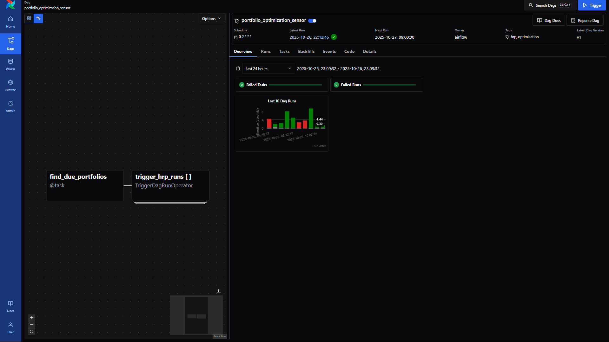
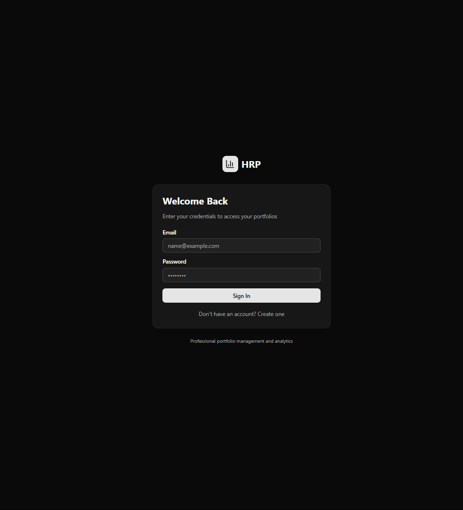
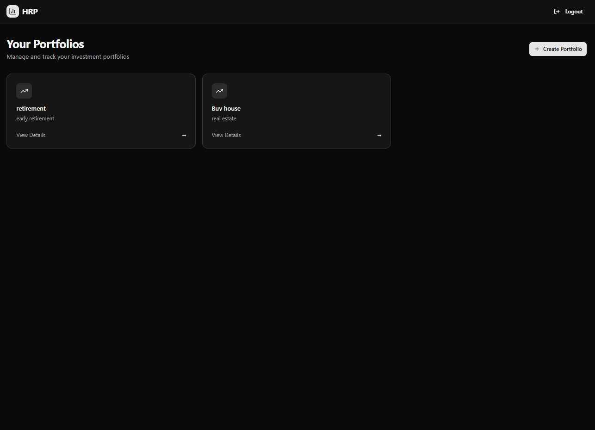
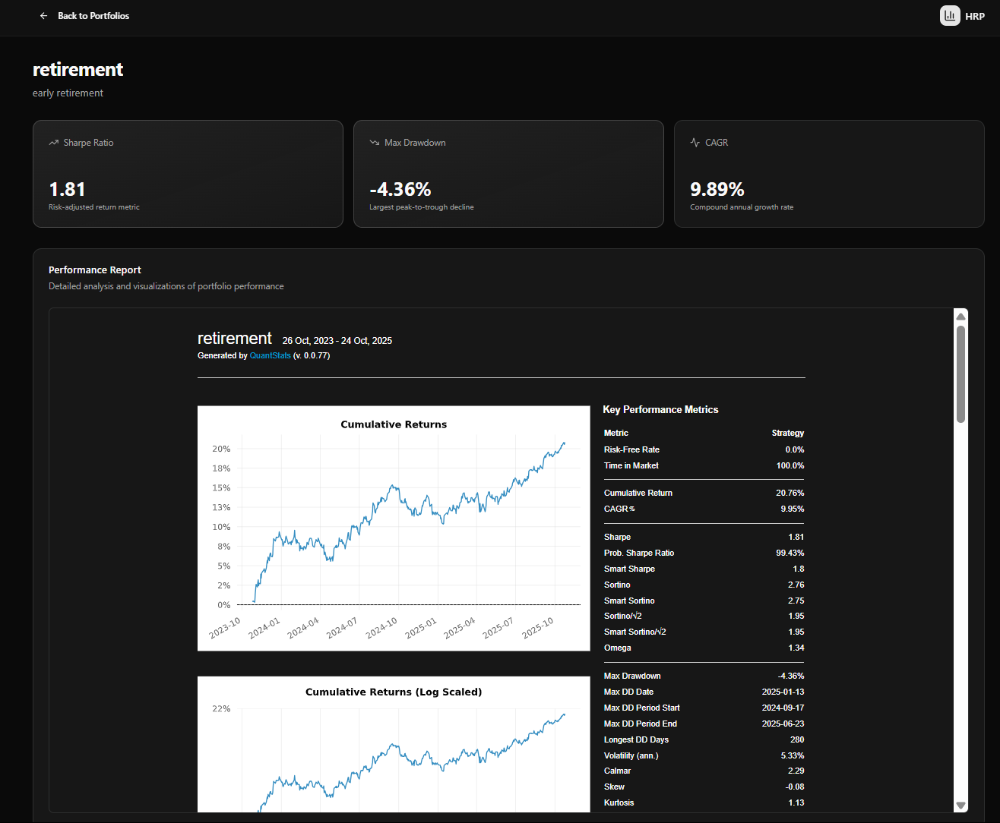

# HRP Portfolio Platform

A portfolio optimization platform based on the Hierarchical Risk Parity (HRP) model, with fully interactive UI and an automated orchestration pipeline for periodic portfolio rebalancing.

## Architecture

- **Backend**: FastAPI with JWT authentication
- **Database**: SQLite with SQLAlchemy ORM (PosgreSQL coming soon, will use docker)
- **Scheduler**: Apache Airflow for orchestration
- **Frontend**: Next with Shadcn UI
- **Core Logic**: riskfolio-lib, quantstats, pandas, yfinance

## TO-DO
- Handle portfolio creation failed (yfinance ticker not found)
- Bugged when return to main page while report is loading (Asynchronous problem?)
- Actually handle Posgres not just SQLite
- Put airflow on the cloud (Terraform)

## Quick Start

### 1. Database Setup
```bash
# Create PostgreSQL database
createdb hrp

# Apply schema (optional - tables auto-created on startup)
psql hrp < db/schema.sql

# Or you can use alembic which I just added in later commit
```

### 2. Install Dependencies
```bash
# Install Python dependencies
uv pip install -r requirements.txt # You can try uv add -r requirements.txt but I didn't use it

# Install frontend dependencies
cd frontend && npm install
```

### 3. Environment Variables (optional - will run again when running starting script)
```bash
export DATABASE_URL="sqlite:///hrp.db" # Should be Posgres in the future
export JWT_SECRET="your-secret-key-change-in-production"
export JWT_ALGORITHM="HS256"
```

### 4. Run the Platform
```bash
# Start both backend and frontend
./start.sh
```
Open another terminal
```bash
# Start airflow server
./airflow.sh
```


## API Endpoints

- **Authentication**: `/auth/register`, `/auth/login`
- **Portfolios**: `/portfolios` (CRUD operations)
- **Reports**: `/portfolios/{id}/report`, `/portfolios/{id}/report/html`
Or just go see in
- **API Docs**: http://localhost:8000/docs

## Airflow DAGs

- `update_daily_prices`: Daily price updates (01:00 UTC)
- `portfolio_optimization_sensor`: Triggers optimization (02:00 UTC)
- `run_hrp_optimization`: HRP optimization execution


## Frontend

- **Login/Register**: User authentication

- **Dashboard**: Portfolio management

- **Portfolio Detail**: View weights and reports


## Database Schema

- `users`: User accounts with JWT authentication
- `portfolios`: Portfolio configurations
- `portfolio_weights`: Optimization results
- `daily_prices`: Historical price data


